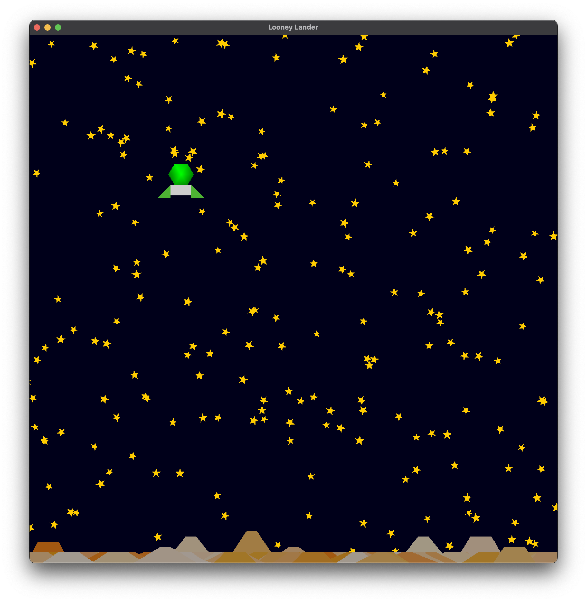
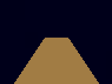
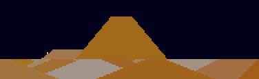
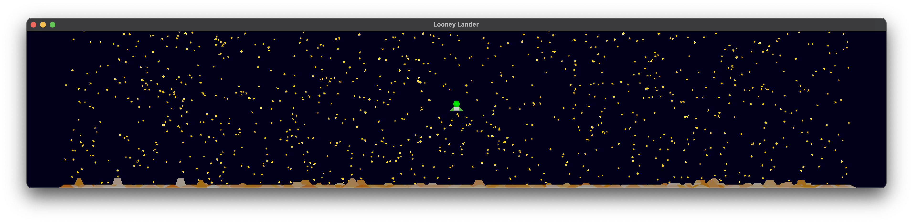
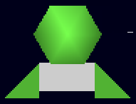
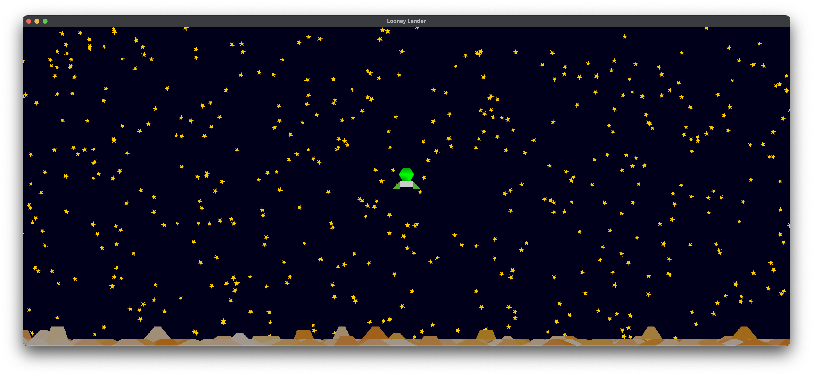
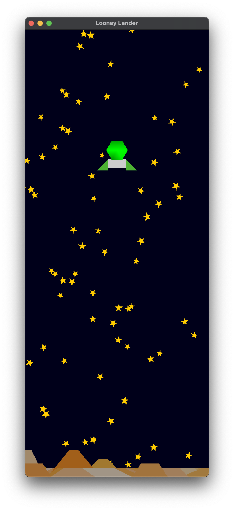

# COMP3170 Assignment 1  – Looney Lander
## Topics covered:
* 2D mesh construction
* HSB and RGB colour spaces
* 2D transformations: rotation, translation, scale
* Animation
* Scene graph
* Coordinate frames
* 2D camera: view and projection matrices, aspect
* Instancing

## ULOs
* ULO1: Understand the fundamentals of vector geometry and employ them in devising algorithms to achieve a variety of graphic effects.
* ULO2: Program 2D and 3D graphical applications using OpenGL embedded in a programming language (such as OpenGL in Java).

## Task Description
Your task is to implement a 2D scene with a lunar or planetary terrain (the planet Loonar ;)) and a background starfield (Figure 1). A Lander floats over the scene, controlled by the keyboard.

 

## Framework
For this assignment, you will need the COMP3170 LWJGL library that we have been using in the workshop classes. See the Week 1 workshop for how to download and install this library. Make sure to pull the latest version of the library from the repository before beginning the project.

This repo is the assignment. Inside this repo, you will find a Java project with the following files:
* `Assignment1.java` – The “bare-bones” driver class for the project.
* `Scene.java` – an example of a Scene class.
* `Lander.java` – an example of a class using the SceneObject class.
* `simple_vertex.glsl / simple_fragment.glsl` – a basic, simple shader.

To complete the assignment, you will need to edit these files and add further classes (and shaders) of your own.

The repo also contains a Report template and folders for images.

## Features
You are required to complete each of the features below. Note that not all features are of equal difficulty.

Note: In the spec, some specific numbers (e.g. the colour and size of the lander, etc) are not specified. You are free to choose whatever values you feel appropriate for these as long as they illustrate the behaviour required. However, remember to use named constants in your code (with comments to indicate units) to allow these values to be easily modified. Clarity marks will be deducted for using ‘magic numbers’ (embedded numerical constants given without explanation). 

## General Requirements
You should use the SceneGraph implementation provided in the comp3170.lwjgl project to organise the objects in your scene.

Throughout this document, we will refer to “world units”. A world unit is defined as a single unit of world space. For example, an object with the following Model to World Matrix:

|i|j|k|T|
|-|-|-|-|
|2|0|0|2|
|0|2|0|3|
|0|0|1|0|
|0|0|0|1|

Is 2 world units in width and height, and positioned at coordinate (2,3) in world space. You can think of 1 world unit as equivalent to 1 metre.

### Loonar Mountain – Mesh (4%)
Create a moutain mesh. The basic shape should be wider at the bottom than at the top. The height of the mountain should vary. A simple approach would be to implement the mountain as a trapezoid, however you might allow for each side of the mountain to be different heights.

### Loonar Colouring (4%)
Mountain colour should be set to a hue of your choice, with a randomly chosen saturation and brightness value ranging from 0% to 100% in HSB space.

### Loonar Surface Terrain (4%)
The Loonar surface terrain can be constructed by drawing lots of mountains.

Clear the background to a dark blue or inky black colour. Randomly position 500 mountains along the bottom of a 100x500 area of world units, as shown in Figure 4. Each mountain should be at least 3 world units wide at the base, and at least 2 world units tall. 

You'll notice that in the figure not all the mountain peaks will stand out, and will actually merge together to create the surface terrain of Loonar.

If you find that your terrain is looking jagged that's okay, but if you'd like to make it look less jagged you can make some changes to the output of the random number generator to skew the results towards either shorter or taller height values.

### Starfield (4%)
Randomly position 1000 stars around the 500 x 100 area of world units, as shown in Figure 6.
* Each star should
  * have exactly five points
  * must be generated by code, not handwritten.
  * stars should be of varying size and rotation.

### Lander – Mesh (6%)
Create a mesh of a Lander with an "ascent module" or cockpit area at the top. This should have a regular polygonal shape (hexagon, ocatagon, circle), and a "descent module" or base, which should be recatangular but also should have landing gear (triangles in the example implementation). You may add more detail to the lander if you like, but remember to keep the basic shape legible for marking.

### Lander – Vertex colouring (4%)
Use vertex colouring to have the Lander components’ colouring change per vertex.

### Lander – Movement (4%)
The Lander can move fire retro-rockets in the up, left, and right directions at a set speed according to the following key strokes:
* W - move up
* A - move left
* D - move right

Downward motion will be due to gravity. Choose a constant value and have it applied to the lander at all times.

### Lander - Dynamic Movement (4%)
If you fire the retro-rockets to the left or right the lander should rotate in the opposite direction relative to the world. The lander should rotate smoothly at a constant rate whilst the left or right rockets are firing. Stopping at a 45 degree angle.

### Lander – Exhaust Animation (4%)
Add animation for the retro-rockets. When you depress the 'W', 'A', or 'D' keys, a single rocket flame should fire out below the lander. If the rocket is moving horizontally ('A' or 'D' keys), the flame should extend in the opposite direction of movement. If there is a vertical component to the movement ('W' key) the flame should be longer than in the *purely* horizontal case. Note that if the movement is both veritcal and horizontal the flame should be longer than purely horizontal movement. This is demonstrated in the below animated png ("rockets.png")

### World camera (8%)
Create a camera that follows the lander. The camera remains stationary, except for if the lander's mesh reaches the top or bottom quarters of the view, in which case the camera should move with it. The camera should remain aligned with the world X/Y coordinates and should not rotate.

## World camera – resizing (6%)
The view volume of the camera should be adjusted proportional to the size of the window, with scaling along the x axis. 

An 800x800 window should show a 40x40 area of world space. Making the window’s height larger (or shorter) should reveal more (or less) of the world without changing the screen size of objects displayed. Making the window wider (or narrower) should scale objects.

## Local Camera (8%)
Add a second camera view that aligns with the orientation of the lander. In this view, the lander should always look vertically aligned, but the world will rotate around the lander.

Swiching between the two cameras should be performed by hitting the '1' key for the world camera, and the '2' key for the local camera.

## Distinction and HD level tasks

The above tasks are enough for you to earn a Credit (with credit-level effort/skill applied, and assuming completed documentation). The below tasks are more challenging, and should only be attempted by students aiming for Distinction and HD marks. We recommend completing the above tasks first before attempting these.

### Parallax Scrolling (8%)
In parallax scrolling the starfield should move with the the camera at a delayed speed to give a sense of depth.

The camera should follow the lander as it moves with respect to the surface of Loonar.

### Instancing (8%)
Implement both the Loonar terrain and the starfield using instancing.
* All the stars are drawn in a single draw call.
* All the mountains that make up the terrain are drawn in a single draw call.

### Boundary control (4%)
Augment your program to ensure that the lander always remains on screen.

Vertical movement should be restricted to the limits of the world. If the camera view is reaching the edge of Loonar's surface, the surface should repeat so as to appear infinte/the lander is "orbitting" it.

There are a few different ways you can approach this. Not all are obvious.

## Documentation
In addition to your code, you should complete the `Report.md` file found at the top level of this repo, addressing all questions. The documentation is worth 20 marks, with this breakdown detailed in the rubric below and the `Report.md` file itself. Images can be placed in the 'ReportImages' folder, also located at the top level of this repo. See `Report.md` for a description of each of these tasks.

Please use a ruler when drawing, and ensure your drawings are clear. Marks may be deducted for messy or unclear drawings.

Note: By virtue of what we are asking you to do here, the documentation mark will scale based on how many components you have completed. For example, you cannot expect to get the full 8% for meshes for doing a perfect ilustration of one mesh.

## Submission
To submit your assignment, you must push this repo with your complete Java project and Report. When you have completed your project, make your final commit `Final Submission` so we know your project is ready to mark. Late submissions will be marked in accordance with the late assessment policy in the Unit Guide.

To allow us to best evaluate your project, practice good version control habits of regular commits with clear and meaningful commit messages.

## Grading
Each of the above components will be individually marked on the rubric below. The total sum of these marks will give you your mark out of 100 for the task (80 for code, 20 for documentation). Marks will not be awarded for elements not meaningfully implemented.

## Rubrics

### Code
Each feature attempted by you will be marked using the below rubric.
|Criteria|Grade|Description|
|-|-|-|
|Correctness|HD (100)|Code relevant to feature is free from any apparent errors. Problems are solved in a suitable fashion. Contains no irrelevant code.|
||D (80)|Code relevant to feature has minor errors which do not significantly affect performance. Contains no irrelevant code.|
||CR (70)|Code relevant to feature has one or two minor errors that affect performance. Problems may be solved in ways that are convoluted or otherwise show lack of understanding. Contains some copied code that is not relevant to the problem.|
||P (60)|Code relevant to feature is functional but contains major flaws. Contains large passages of copied code that are not relevant to the problem.|
||F (0-40)|Code relevant to feature compiles and runs, but major elements are not functional.|
|Clarity|HD (100)|Good consistent style. Well structured & commented code relevant to feature. Appropriate division into classes and methods, to make implementation clear.|
||D (80)|Code relevant to feature is readable with no significant code-smell. Code architecture is adequate but could be improved.|
||CR (70)|Code relevant to feature is readable but has some code-smell that needs to be addressed. Code architecture is adequate but could be improved.|
||P (60)|Significant issues with quality of code relevant to feature. Inconsistent application of style. Poor readability with code-smell issues. Code architecture could be improved.|
||F (0-40)|Significant issues with quality of code relevant to feature. Inconsistent application of style. Poor readability with code-smell issues. Messy code architecture with significant encapsulation violations.|

### Documentation
Each component of your documentation will be marked against the corresponding criteria below.

|Component|Grade|Description|
|-|-|-|
|Scene Graph (4%)|HD (100)|Scene graph is clear, easy to read and makes appropriate use of colouring and arrows to convey information. Scene graph precisely represents code.|
||D (80)|Scene graph is clear and easy to read. Scene graph precisely represents code.|
||CR (70)|Scene graph may contain minor errors in clarity and legibility, and may miss some nuance of implementation in code.|
||P (60)|Scene graph may miss some nuance of implementation in code. Errors in clarity and legibility, but still understandable.|
||F (0-40)|Scene graph is difficult to visually parse or does not match code.|
|Mesh Illustrations (4%)|HD (100)|Illustrations are neat, clear and well annotated. No discrepancies between illustrations and code.|
||D (80)|Illustrations are neat and clear. No discrepancies between illustrations and code.|
||CR (70)|Minor sloppiness or missing detail. Minor discrepencies between documentation and code.|
||P (60)|Significant sloppiness or missing detail. Values in illustrations show understanding of task, but may not reflect code.|
||F (0-40)|Illustrations are unclear and badly drawn. Does not make use of graph paper. Illustrations are just screenshots from project or otherwise do not demonstrate an understanding of the purpose of documentation.|
| World Camera Calculations (8%)|HD (100)| Different calculations are clearly distinguishable in diagram. Values are accurate and representative of code. Diagram is neat, clear and well annotated.|
||D (80)|Minor sloppiness or missing detail. No discrepancies between documentation and code.|
||CR (70)|Minor sloppiness or missing detail. Values in diagram may be internally accurate, but does not match code.|
||P (60)|Significant sloppiness and missing detail. Values in diagram show understanding of the different coordinates.|
||F (0-40)|Diagram is unclear and badly drawn. Inacurate values, and/or major discrepencies between documentation and code.|

## Resources and Help
If you have any questions about the task, please post on the iLearn forums. Alternatively, you can email staff if the question is specific to your implementation.

### Colours
For help picking colours that go well together, using existing colour palettes found online can be a good place to start. [Color Hunt](https://colorhunt.co/) and [Coolor](https://coolors.co/) are both useful places to find palettes others have made. Alternatively, you use [Canva's Color Wheel](https://www.canva.com/colors/color-wheel/) to find colours that compliment one another and build your own palettes.

### Digital drawings
You may wish to use digital tools to create your drawings for documentation, and also to help you figure things out. We strongly recommend [Virtual Graph Paper](https://virtual-graph-paper.com/). Cam uses it in his lectures! [Geogrebra](https://www.geogebra.org/) is also a useful tool for linear algebra calculations and diagrams.

