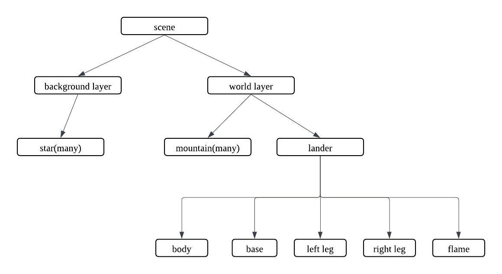
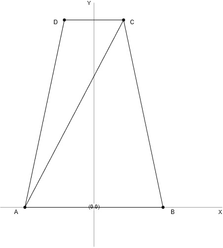
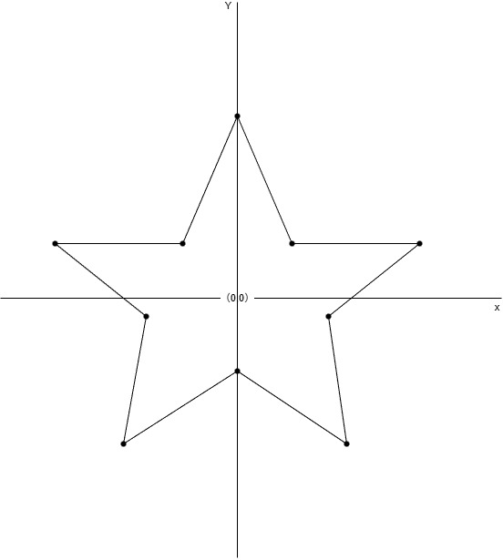
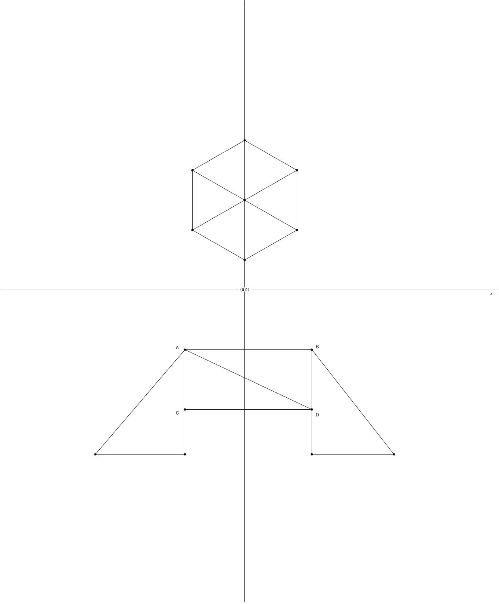

# COMP3170 Assignment 1 Report
### Student Name: [Xinyan Wang]
### Student ID: [47354186]

## Your Development Environment
|Spec|Answer|
|----|-----|
|Java JDK version used for compilation|JDK 24 (system javac), project compiled with Java 17 compliance in Eclipse|
|Java compiler compliance level used for compilation|17|
|Java JRE version used for execution|JRE 17.0.10|
|Eclipse version|Eclipse IDE for Java Developers, Version 2023-12 (4.30.0)|
|Your screen dimensions (width x height)|1920*1080|
|Your computer type (Mac/PC)|PC|
|Your computer make and model|MSI MS-7C95|
|Your computer Operating System and version|Windows 11 Pro, version 25H2, OS build 26200.8037|

## Features Attempted
Complete the table below indicating the features you have attempted. This will be used as a guide by your marker for what elements to look for, and dictate your <b>Completeness</b> mark.

|Feature|Weighting|Attempted Y/N|
|-------|---------|-------------|
|<b>Code</b>|
|Mountain – Mesh|4%|Y|
|Mountain - Colouring|4%|Y|
|Surface Terrain|4%|Y|
|Starfield|4%|Y|
|Lander – Mesh|6%|Y|
|Lander – Vertex colouring|4%|Y|
|Lander – Movement|4%|Y|
|Lander – Dynamic Movement|4%|Y|
|Exhaust – Animation|4%|Y|
|World camera |8%|Y|
|World camera – resizing|6%|Y|
|Local camera |8%|Y|
|Parallax scrolling|8%|Y|
|Instancing|8%|N|
|Boundary control|4%|Y|
|<b>Documentation</b>|
|Scene Graph|5%|Y|
|Mesh Illustrations|5%|Y|
|World Camera Calculations|10%|Y|
|<b>Total</b>|-|-|

## Scene Graph (5%)
Include a drawing (pen-and-paper or digital) of the scene graph used in your project.

The scene graph in mu projet has a root 'scene'object. below the root, the scene is divided into two layer:
-`backgroundlayer`,which contains the starfield.
-`worldlayer`,which contains the terrain an the lander

This design supports parallax scrolling by allowing the background layer to move slowly than the worldlayer

## Mesh illustrations (10%)
Include illustrations of <b>all</b> the meshes used in your project, drawn to scale in model coordinates, including:
* The origin
* The X and Y axes
* The coordinates of each vertex
* The triangles that make the mesh

Each mesh will contribute to this mark. You cannot expect to get the full 10% for a perfect illustration of only one mesh.

### Mountain Mesh

The mountain mesh is implemented as a trapezoid using two triangles.  
This shape was chosen because it satisfies the specification requirement that the mountain should be wider at the bottom than at the top. In the actual scene, many mountain objects are instantiated with different widths, heights, and colours to form the terrain. The illustration below shows a representative mountain mesh in model coordinates.

### Star Mesh

The star mesh is a procedurally generated five-pointed star.  
It is constructed from alternating outer and inner vertices around the origin, then triangulated from the centre into multiple triangles. This allows the same mesh structure to be reused for stars of different sizes and rotations in the starfield.

### Lander Mesh

The lander is built from multiple meshes rather than a single primitive shape.  
Its main components are:
- a hexagonal cockpit/body,
- a rectangular base,
- two triangular landing legs,
- and a triangular exhaust flame.

This modular structure made it easier to organise the geometry, apply vertex colouring, and later support movement, rotation, and exhaust animation. The illustration below shows the main lander components in model coordinates.

## World camera calculations (5%)
Include a diagram illustrating the world camera calculations, including:
* The viewport rectangle
* The mapping from view (camera centric) coordinates to NDC
* The mapping from NDC to viewport (pixel) coordinates

The diagram should include a legend or other clear indication as to what calculation each colour is being used to represent.

The diagram should follow the below format, but with values relevant to your project:

