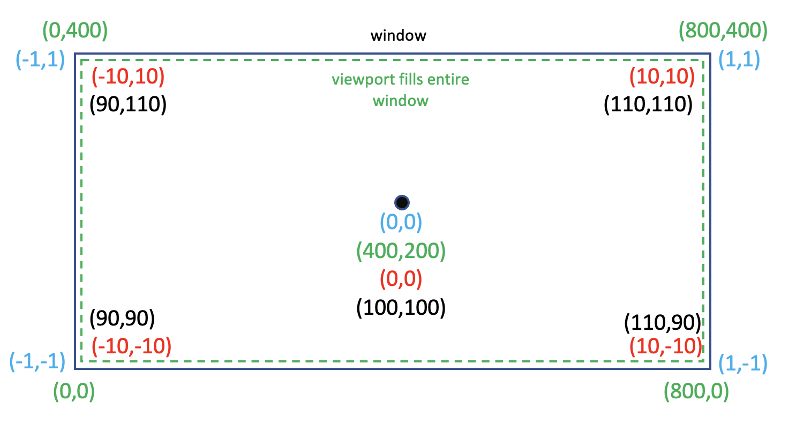

# COMP3170 Assignment 1 Report
### Student Name: [Your name here]
### Student ID: [Your ID here]

## Your Development Environment
|Spec|Answer|
|----|-----|
|Java JDK version used for compilation|-|
|Java compiler compliance level used for compilation|-|
|Java JRE version used for execution|-|
|Eclipse version|-|
|Your screen dimensions (width x height)|-|
|Your computer type (Mac/PC)|-|
|Your computer make and model|-|
|Your computer Operating System and version|-|

## Features Attempted
Complete the table below indicating the features you have attempted. This will be used as a guide by your marker for what elements to look for, and dictate your <b>Completeness</b> mark.

|Feature|Weighting|Attempted Y/N|
|-------|---------|-------------|
|<b>Code</b>|
|Mountain – Mesh|4%|-|
|Mountain - Colouring|4%|-|
|Surface Terrain|4%|-|
|Starfield|4%|-|
|Lander – Mesh|6%|-|
|Lander – Vertex colouring|4%|-|
|Lander – Movement|4%|-|
|Lander – Dynamic Movement|4%|-|
|Exhaust – Animation|4%|-|
|World camera |8%|-|
|World camera – resizing|6%|-|
|Local camera |8%|-|
|Parallax scrolling|8%|-|
|Instancing|8%|-|
|Boundary control|4%|-|
|<b>Documentation</b>|
|Scene Graph|5%|-|
|Mesh Illustrations|5%|-|
|World Camera Calculations|10%|-|
|<b>Total</b>|-|-|

## Scene Graph (5%)
Include a drawing (pen-and-paper or digital) of the scene graph used in your project.

## Mesh illustrations (10%)
Include illustrations of <b>all</b> the meshes used in your project, drawn to scale in model coordinates, including:
* The origin
* The X and Y axes
* The coordinates of each vertex
* The triangles that make the mesh

Each mesh will contribute to this mark. You cannot expect to get the full 10% for a perfect illustration of only one mesh.

## World camera calculations (5%)
Include a diagram illustrating the world camera calculations, including:
* The viewport rectangle
* The mapping from view (camera centric) coordinates to NDC
* The mapping from NDC to viewport (pixel) coordinates

The diagram should include a legend or other clear indication as to what calculation each colour is being used to represent.

The diagram should follow the below format, but with values relevant to your project:

